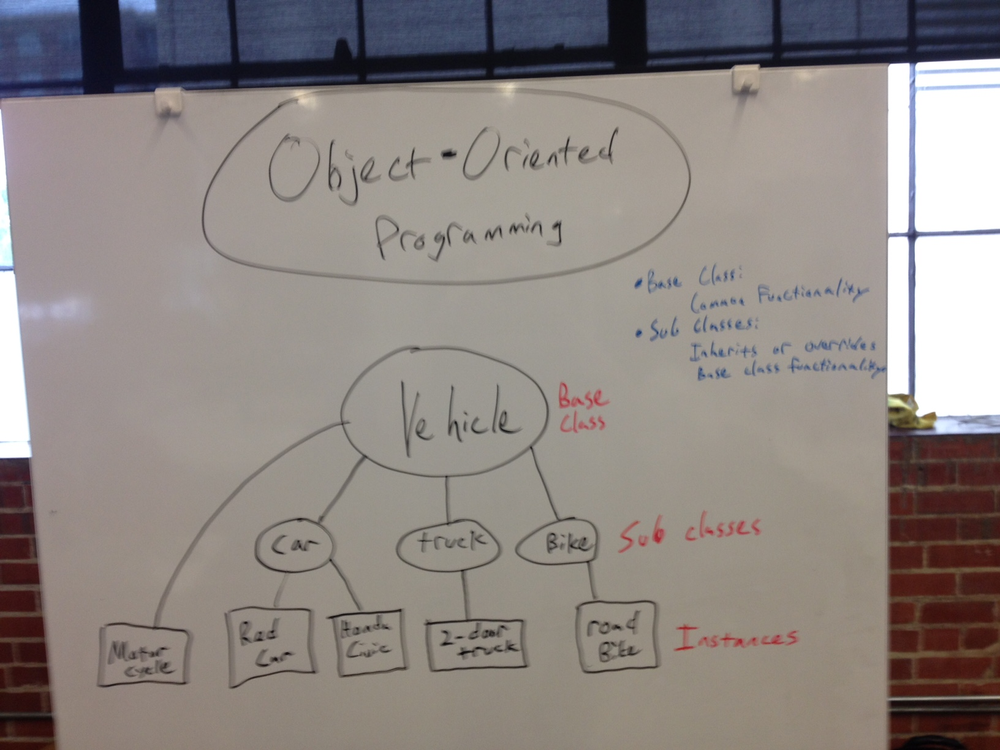

# Objecting-oriented Programming - intro

Object-oriented Programming (OOP) is a type of programming [paradigm](https://en.wikipedia.org/wiki/Programming_paradigm) that uses abstractions to model real-world models, called Classes. In essence, OOP organizes code into numerous pieces that all work together.

One of the main benefits of OOP is modularity. Because of this, you do *not* have to understand every single line of code in your code base. If you define a Class in one file, you just need to know how to create an instance of that class. In other words, you just need to know the Class name and its associated properties and parameters - not all of the code in the class. I can create a `Car()` class, and you can utilize it just by knowing the available properties and methods.

- [Objectives](#objectives)
- [Key terms](#key-terms)
- [Constructor Function](#constructor-function)
- [Methods](#methods)
- [Quick Challenges](#quick-challenges)
- [Read and Watch](#read-and-watch)
- [Inheritance](#inheritance)
- [Another Challenge](#another-challenges)

## Objectives

- Objected Oriented Programming in JavaScript
  - Summarize OO principles in student’s own words: Encapsulation, Abstraction, Modularity
  - Define 'Object Oriented Programming' and compare and contrast it with functional programming.
  - Explain what constructor functions are and why they help prevent redundancy when creating objects
  - Examine JavaScript’s global objects like `Array`, `Object`, etc and differentiate between instance methods like `.push()`/`.pop()` and global object methods like `.isArray()`.
  - Explain what the keyword `this` refers to when writing constructor functions and prototype methods.
  - Distinguish between class methods and instance methods
  - Articulate the difference and benefits to adding methods to the prototype vs. the constructor
  - Explain the difference between setting properties in a constructor function vs. the prototype

## Key terms

- Constructor function
- The `new` keyword
- The `this` keyword
- Prototype object
- Encapsulation (creation)
- Inheritance (reuse)

## Constructor Function

> Scaffold out a new project from the generator and follow along with the examples...

Let's start by creating our first Class.

```javascript
// *** Intro to OOP *** //

// Base Class
var Vehicle = function(){
  // properties
  this.wheels = 4;
  this.color = 'black';
};

// Instances
var blackCar = new Vehicle();
console.log(blackCar);
```

1. Unlike many other OO languages such as Ruby, Java, and Python, JavaScript does not have a `class` keyword (prior to ECMAScript 6).
1. Notice how the function name for the class starts with a capital letter. This is convention; it helps to distinguish between a regular function and a class.
1. **What is `this`?** It's an arbitrary placeholder object that lives in the scope. Every scope has a `this` object! It's simply a placeholder that points to the current object.

**How do we make this dynamic?**

```javascript
// *** Intro to OOP *** //

// Base Class - constructor
var Vehicle = function(wheels, color){
  // properties
  this.wheels = wheels;
  this.color = color;
};

// Instances
var car = new Vehicle(4, 'red');
console.log(car);
```

> `new`? The `new` keyword alerts the JavaScript interpreter that we want to use the function as a constructor in order to create an object.

**So...**

1. The instance properties are nouns, describing the object
1. The constructor is a blueprint used to create multiple objects


## Methods

We can also assign methods to the prototype object, which *act* upon the object:

```javascript
// *** Intro to OOP *** //

// Base Class - constructor
var Vehicle = function(numberOfWheels, carColor){
  // properties
  this.wheels = numberOfWheels;
  this.color = carColor;
};

// Methods
Vehicle.prototype.honk = function() {
  return 'honk!';
};

// Instances
var redCar = new Vehicle(4, 'red');
console.log(redCar);
console.log(redCar.honk());
```

**Take a look in Dev Tools**:


### `toString()` method

Next, let's add a `toString()` method to the prototype to make the output more readable:

```javascript
// *** Intro to OOP *** //

// Base Class - constructor
var Vehicle = function(numberOfWheels, carColor){
  // properties
  this.wheels = numberOfWheels;
  this.color = carColor;
};

// Methods
Vehicle.prototype.honk = function() {
  return 'honk!';
};
Vehicle.prototype.toString = function() {
  return 'The vehicle has ' + this.wheels + ' wheels and is ' +
    this.color + '.';
};

// Instances
var redCar = new Vehicle(4, 'red');
console.log(redCar);
console.log(redCar.honk());
console.log(redCar.toString());
```

**How about built-in methods?**

Open up Dev Tools, and type in `String.prototype.` into the console. You should see all the built-in methods associated with the `String` class.

## Quick Challenges

1. Create a class called `Song()` with two properties:
  - `songName` - i.e., 'A day in the Life'
  - `bandName` - i.e., 'The Beatles'
1. Create a new instance of the class with the `new` keyword, storing it in a variable
1. Add two methods to the prototype:
  - `countName` - return the total number of words in the song name
  - `createElement` - create a new DOM element with jQuery
1. Append the instance to the DOM

## Read and Watch

- Read [Objects and classes by example](http://book.mixu.net/node/ch6.html)
- [Watch this video](https://www.youtube.com/watch?v=xVnW7ZMqBus)

## Inheritance

Using inheritance, you can define multiple sub-classes that contain the same base-class. This helps to prevent code duplication. Keep it DRY!

```javascript
// *** Inheritance *** //

// Base Class - constructor
var Vehicle = function(wheels, color){
  // properties
  this.wheels = wheels;
  this.color = color;
};

// Methods
Vehicle.prototype.honk = function() {
  return 'honk!';
};
Vehicle.prototype.toString = function() {
  return 'The vehicle has ' + this.wheels + ' wheels and is ' +
    this.color + '.';
};

// Car Class
var Car = function(color){
  this.wheels = 4;
  this.color = color;
};

Car.prototype = new Vehicle();
Car.prototype.drive = function(distance) {
  return "The car moved " + distance + ' miles!';
};

// Instance of the Car sub-class
var redCar = new Car('red');
console.log(redCar);
console.log(redCar.honk());
console.log(redCar.drive(10));
console.log(redCar.toString());

// Instance of the Vehicle base class
var smallMotorcycle = new Vehicle(2, 'black');
console.log(smallMotorcycle);
console.log(smallMotorcycle.honk());
console.log(smallMotorcycle.toString());
```

1. Since we know that cars have four wheels we can just have the class take a color.
1. To *extend* all of our methods associated with the Vehicle class we need to take advantage of inheritance - `Car.prototype = new Vehicle();`.
1. Now the car is an instance of the `Car()` sub-class, which inherits from the `Vehicle()` base class.
1. Finally, there is new method, `drive()`, on the `Car()` prototype.

**What if we want to override a method in a sub-class?**

```javascript
// *** Inheritance *** //

// Base Class - constructor
var Vehicle = function(wheels, color){
  // properties
  this.wheels = wheels;
  this.color = color;
};

// Methods
Vehicle.prototype.honk = function() {
  return 'honk!';
};
Vehicle.prototype.toString = function() {
  return 'The vehicle has ' + this.wheels + ' wheels and is ' +
    this.color + '.';
};

// Car Class
var Car = function(color){
  this.wheels = 4;
  this.color = color;
};

Car.prototype = new Vehicle();
Car.prototype.drive = function(distance) {
  return "The car moved " + distance + ' miles!';
};
Car.prototype.honk = function(){
  return 'car honk!';
};

// Instance of the Car sub-class
var redCar = new Car('red');
console.log(redCar);
console.log(redCar.honk());
console.log(redCar.drive(10));
console.log(redCar.toString());

// Instance of the Vehicle base class
var smallMotorcycle = new Vehicle(2, 'black');
console.log(smallMotorcycle);
console.log(smallMotorcycle.honk());
console.log(smallMotorcycle.toString());
```

Here, there is a `honk()` method applied to the `Car()` class that overrides the same method from the `Vehicle()` class.

> When you are thinking about creating a sub-class, think "is a". For example, a red car "is a" car and a car "is a" vehicle.



## Another Challenge

Given the following constructor and object (instance)...

```javascript
var Person = function(firstAndLastName) {
  this.firstAndLastName = firstAndLastName;
  this.isInstructor = true;
};

var michael = new Person('Michael Herman');
```

...create these methods:

- `getFullName()`
- `getFirstName()`
- `getLastName()`

Next, add a `Student()` sub-class that overrides the `isInstructor` property. Make sure you inherit all the methods associated with the base-class. Then create an instance of the sub-class.
