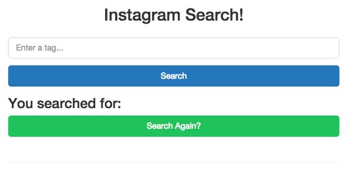
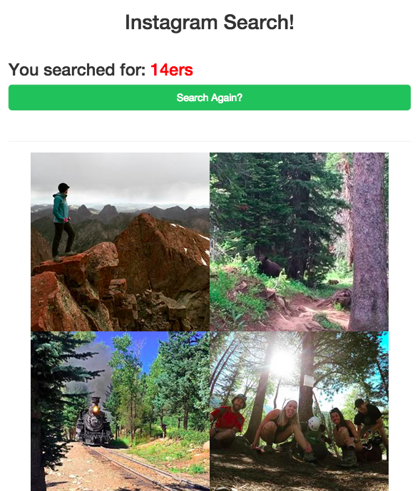
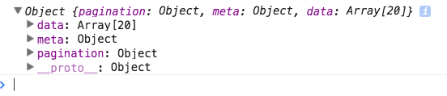
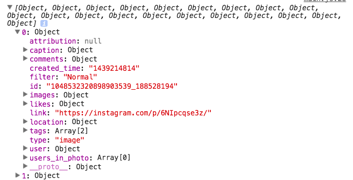
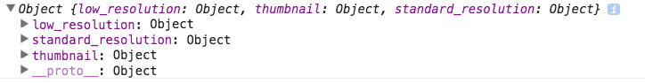

# AJAX and Web APIs - a primer

This article looks at how to utilize AJAX (asynchronous JavaScript and XML) to request data from an external server - e.g, a web API - and handle the returned data appropriately by making it accessible in the DOM.

1. [Objectives](#objectives)
1. [Key terms](#key-terms)
1. [Introduction to APIs](#introduction-to-apis)
1. [API Restrictions and Workarounds](#api-restrictions-and-workarounds)
1. [Utilizing API Data](#utilizing-api-data)
1. [Working with API Data](#working-with-api-data)
1. [Stretch](#stretch)
1. [Further Reading](#further-reading)

## Objectives

By the end of this lesson you should be able to...

- explain what AJAX stands for
- write code that grabs JSON data from an API and does something with it
- write syntactically valid AJAX calls using the jQuery method `$.ajax`
- describe what happens when `$.ajax` is invoked - that it takes an object as an argument, that it makes an HTTP request, that the `then` functions fire on a 200 response, that the error functions fire on non-2xx responses
- write AJAX calls that send form parameters from an object
- write AJAX calls that send the request body as JSON
- define API
- discuss how APIs are used to connect services across the web
- define and describe JSON
- Use `JSON.parse()` to turn JSON into a JavaScript object.
- Use jQuery AJAX methods to hit an API and use the returned JSON to populate information on an web page
- explain the XMLHTTPRequest same domain policy
- explain the JSONP workaround to the same domain policy
- specify a JSONP callback parameter in an ajax request

## Key terms

1. AJAX/XMLHTTPRequest
1. JSON
1. JSONP
1. API
1. Web Service/Web API
1. Endpoint
1. CORS (cross-origin resource sharing)
1. Same-origin policy

## Setup

1. Create a new local project directory called "js-ajax-instagram".
1. Add a local git repository.
1. Create a remote repository on Github.
1. Create a project boilerplate with the [Galvanize HTML Generator](https://github.com/gSchool/generator-galvanize-html).
1. Update your *index.html* and *main.css* files from the code found [here](https://github.com/gSchool/g11-course-curriculum/tree/master/week06/06_exercises/js-ajax-instagram).
1. Finally, add/commit to your local git repo, and then push your changes to Github.

> Remember to commit your code early and often!

## Introduction to AJAX and APIs

### AJAX

Start by watching this, [What is AJAX?](https://www.youtube.com/watch?v=RDo3hBL1rfA), basic overview of AJAX. So, AJAX (also called XMLHTTPRequest) is used for exchanging data with an API and updating portions of a web page asynchronously, in order to avoid a page refresh.

### API

An [API](https://en.wikipedia.org/wiki/Application_programming_interface) is an Application Programming Interface. It provides a means for external, third parties to write code that interacts with the API provider. A [web service](https://en.wikipedia.org/wiki/Web_API) (or web API) is a type of API that generally operates over HTTP, allowing web developers to access third party data for use on their own websites. For example, you could utilize real estate data from the API provided by the New York Times to generate charts and graphs for your local real estate market.

It's important to note that APIs provide access (reading and writing) to data from a site's database, but prevent the user making the request from getting anywhere close to the database.

Let's look at a quick example...

### IMDB (err, OMDB)

Have you heard of [IMDB](http://www.imdb.com/). Well, even though they do not officially offer an API, a developer built an API using IMDB Data called [OMDB](http://omdbapi.com/). Let's test it out. Try out these requests in your browser:

1. [http://www.omdbapi.com/?t=Star+Wars&r=json](http://www.omdbapi.com/?t=Star+Wars&r=json)
1. [http://www.omdbapi.com/?t=Godfather&y=&plot=full&r=json](http://www.omdbapi.com/?t=Godfather&y=&plot=full&r=json)
1. [http://www.omdbapi.com/?t=Citizen+Kane&y=&plot=full&r=json](http://www.omdbapi.com/?t=Citizen+Kane&y=&plot=full&r=json)

> The above URLs are often referred to as endpoints. Make a mental note of this, as you will hear this term used often when working with web services.

**What do you see?**

Put simply, you should see data pertaining to each movie in a format called JSON.

### JSON

JSON, which stands for JavaScript Object Notation, organizes data in a manner that's easy to read, by both humans and computers, and share.

Go back to the Star Wars request in your browser.

> Is this a garbled mess? Download the chrome extension [JSON View](https://chrome.google.com/webstore/detail/jsonview/chklaanhfefbnpoihckbnefhakgolnmc?hl=en-US) to make JSON data viewable in the browser.

You should see something like:

```json
{
  Title: "Star Wars",
  Year: "1983",
  Rated: "N/A",
  Released: "01 May 1983",
  Runtime: "N/A",
  Genre: "Action, Adventure, Sci-Fi",
  Director: "N/A",
  Writer: "N/A",
  Actors: "Harrison Ford, Alec Guinness, Mark Hamill, James Earl Jones",
  Plot: "N/A",
  Language: "English",
  Country: "USA",
  Awards: "N/A",
  Poster: "N/A",
  Metascore: "N/A",
  imdbRating: "7.8",
  imdbVotes: "316",
  imdbID: "tt0251413",
  Type: "game",
  Response: "True"
}
```

Look familiar? It should. It's simply an object with key/value pairs. Keep in mind that, there are subtle differences between JSON and a regular JavaScript object. Watch the following video, [What is JSON?](https://www.youtube.com/watch?v=40aKlrL-2V8), to learn more.

## API Restrictions and Workarounds

For security reasons, web browsers prevent "cross-site" or "cross-site" request from one domain to another in order to prevent malicious attacks from one website to another through the DOM.

> For more on this, read about the the [same-origin policy](https://en.wikipedia.org/wiki/Same-origin_policy).

These restrictions have made it difficult for web developers to access third-party web services.

Fortunately, there are two ways around this policy - [Cross-origin resource sharing](https://en.wikipedia.org/wiki/Cross-origin_resource_sharing) (CORS) and [JavaScript with Padding](https://en.wikipedia.org/wiki/JSONP) (JSONP).

Put simply, CORS provides a means for defining the specific resources that are available cross-site. It's a standard that is [available](http://caniuse.com/#search=cors) in most modern web browsers, which enables negotiation to happen between a request and the external server.

JSONP, on the other hand, is less secure since it is used to "trick" browsers into making "cross-site" requests. Because of this, CORS is the preferred method of getting around the same-origin policy, except in cases where it's not supported by the browser. That said, since this project/tutorial is meant to detail the basics of AJAX and APIS, we will be using a JSONP supported API since, in most cases, CORS-enabled web services since these requests can be complicate.

## Utilizing API Data

Now, let's build a fully working example using the [Instagram API](https://instagram.com/developer/). The finished app will allows us to enter an string and return Instagram images based on that string.

Open up the *index.html* file from "js-ajax-instagram" within Chrome and you should see:



Before we jump into AJAX, hide the search again form:

```javascript
$(document).on('ready', function() {

  // hide search again form
  $('#search-again').hide();

});
```

We also need to grab the user input:

```javascript
$(document).on('ready', function() {

  // hide search again form
  $('#search-again').hide();

  // event handler for search form submission
  $('#tag-search').on('submit', function(event){

    // prevent browser default behavior
    event.preventDefault();

    // container for image urls
    var imageURLs = [];
    // grab tag from input
    var $searchString = $('#tag_query').val();

    console.log($searchString);

  });

});
```

Test this out in your browser.

### Making an AJAX Request

So, now we're ready to make the external API request to Instagram using `$.ajax`. Take a look at the documentation for this jQuery method [here](http://www.w3schools.com/jquery/ajax_ajax.asp). Now let's look at the code for requesting data from the Instagram API:

```javascript
var searchUrl = "https://api.instagram.com/v1/tags/" + $searchString + "/media/recent";

// ajax request
$.ajax({
  url: searchUrl,
  type: 'GET',
  data: {client_id:'61f8b631abd34732a3bcd8c73d0d73a9'},
  dataType:'jsonp',
  success:function(data){
    // assign returned data to output variable
    var output = data.data;
    // clear image container
    $("#image-container").html('');
    // iterate through the returned data, appending the images to the dom
    for(var i = 0; i < output.length; i++) {
      imageURLs[i] = output[i].images.low_resolution.url;
      $("#image-container").append('');
    }
    // clear form input
    $('#tag_query').val('');
    // hide the search form
    $('#search').hide();
    // add search term to the dom
    $('#search-term').html($searchString);
    // show the search again form
    $('#search-again').show();
  },
  error:function(data){
    alert("Sorry we're experiencing technical difficulties. Please try again later.");
  }
});
```

**What's happening?**

1. First, we defined the endpoint that we want to request data from, `searchUrl` by passing the `$searchString` to it.
1. Then utilizing the `url`, `type`, `data`, and `dataType` properties, we make the actual request. Essentially, we are asking Instagram for JSONP data, based on our search parameters -
  - `url` - endpoint that we're requesting data from
  - `type` - a GET request is simply a request asking for data; anytime you visit a website you are making a GET request (more on this in a future tutorial)
  - `data` - here we are adding an ID required by the API (again, more on this in a future tutorial)
  - `dataType` - since we're grabbing JSONP data, we can specify JSONP data as the data type and then convert it to JSON.
1. Next, we're handling a `success` - meaning that we get a 200 response back - by iterating through the returned data (e.g., JSON), grabbing the image URL (by parsing the JSON data), and then appending the data to the DOM.

The remaining steps should be fairly straightforward. If you have questions, check the inline code comments.

The final JavaScript file should look like:

```javascript
$(document).on('ready', function() {

  // hide search again form
  $('#search-again').hide();

  // event handler for search form submission
  $('#tag-search').on('submit', function(event){

    // prevent browser default behavior
    event.preventDefault();

    // container for image urls
    var imageURLs = [];
    // grab tag from input
    var $searchString = $('#tag_query').val();
    // create search URL for hitting the instagram
    var searchUrl = "https://api.instagram.com/v1/tags/" + $searchString + "/media/recent";

    // ajax request
    $.ajax({
      url: searchUrl,
      type: 'GET',
      data: {client_id:'61f8b631abd34732a3bcd8c73d0d73a9'},
      dataType:'jsonp',
      success:function(data){
        // assign returned data to output variable
        var output = data.data;
        // clear image container
        $("#image-container").html('');
        // iterate through the returned data, appending the images to the dom
        for(var i = 0; i < output.length; i++) {
          imageURLs[i] = output[i].images.low_resolution.url;
          $("#image-container").append('');
        }
        // clear form input
        $('#tag_query').val('');
        // hide the search form
        $('#search').hide();
        // add search term to the dom
        $('#search-term').html($searchString);
        // show the search again form
        $('#search-again').show();
      },
      error:function(data){
        alert("Sorry we're experiencing technical difficulties. Please try again later.");
      }
    });

  });

});

function convertToJSON(data) {
  var datastring = JSON.stringify(data);
}
```

Go back and look at the actual AJAX request. Identify the parts of the code that are used for exchanging data with an API? Which parts are for updating the your application? Test this out in the browser. Did you notice how this all happens without a page refresh!



At this point you need to register for a `client_id` from the [Instagram API](https://instagram.com/developer/). If you don't do this you will eventually get an error. Simply login, click *Manage Accounts*, and then create a new account. Enter dummy info, like so:


On the next page, just grab the `client_id` and add it to your code. Test it out again in your browser.

Next, let's take a closer look at how the JSON data was parsed...

## Working with API Data

In the above example, we parsed the JSON data like so:

```javascript
var output = data.data;
for(var i = 0; i < output.length; i++) {
  imageURLs[i] = output[i].images.low_resolution.url;
  $("#image-container").append('');
}
```

How did we know how to do this? Practice. Plus a little help from our old friend, the `console.log()`. Let's look at how to parse this, step-by-step.

### Step 1: `data`

Start by looking at what `data` returns by adding a `console.log(data)` just below the `success:function(data){` line. Test this out in the browser and open the console. You should see something like:



So, you can see that the returned data is an object. Take a look at the following key/value pair:

```javascript
data: Array[20]
```

The value associated with this key is an array of twenty objects.

Let's dig a bit deeper.

### Step 2: `data.data`

Just like before, go ahead and add another `console.log`, right after the last one:


```javascript
// *** JSON Parsing *** //
// console.log(data);
console.log(data.data);
```

Again, look at this in the console:



Each object now contains a plethora of *useful* data that you could use in an app. If you jump back to our code, we looped through the array of objects and pulled out the small image:

```javascript
for(var i = 0; i < output.length; i++) {
  imageURLs[i] = output[i].images.low_resolution.url;
  $("#image-container").append('');
}
```

What else can we get from the `image` object?

### Step 3: `image` object

Simple. Let's break the object down even further:

```javascript
console.log(data.data[0].images);
```



Now we can get the image we want - `low_resolution`, `standard_resolution`, or `thumbnail`.

### Parsing Summarized

Need to break apart (parse) an object? Start console logging it. See if you can break it apart with a single `console.log` and then updating it live in the console. This will save time. Or try it in the browser (for GET requests). We'll go over this as a class.

## Stretch

- Stretch Goal! Create a Pokemon Library, similar to the [Game Library](https://github.com/gSchool/g11-course-curriculum/tree/master/week05/05_exercises/js-game-library), using data from [Pokéapi - The Pokémon RESTful API](http://pokeapi.co/).

## Further Reading

1. [Code a Simple Github API Webapp using jQuery & Ajax](http://blog.teamtreehouse.com/code-a-simple-github-api-webapp-using-jquery-ajax)
1. [StackOverflow: So, JSONP or CORS?](http://stackoverflow.com/questions/12296910/so-jsonp-or-cors)
1. [A Beginner’s Guide To jQuery-Based JSON API Clients](http://www.smashingmagazine.com/2012/02/beginners-guide-jquery-based-json-api-clients/)
